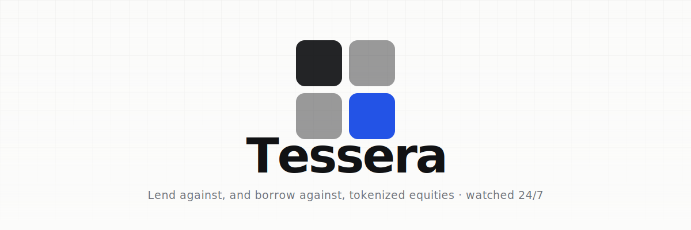
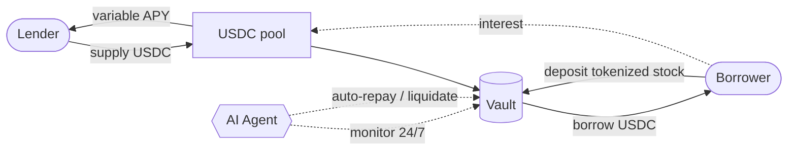
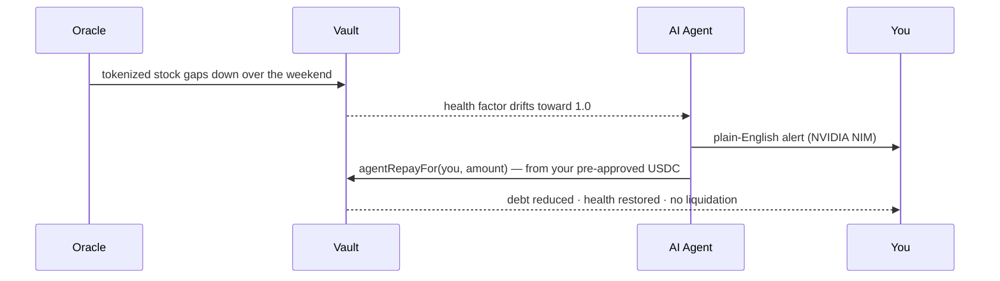
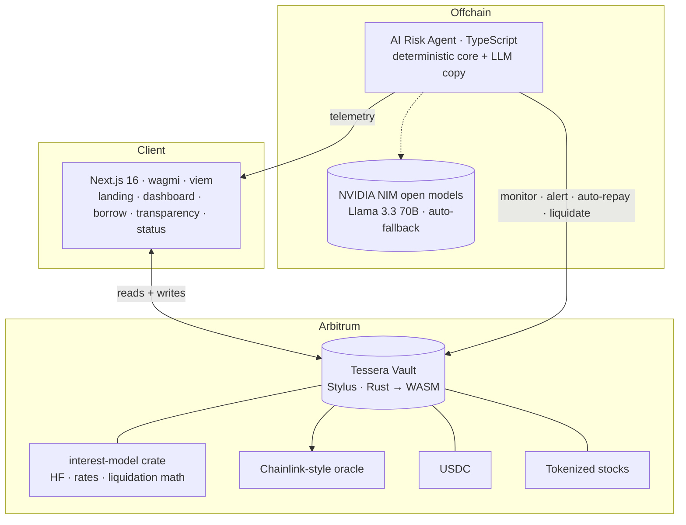

<div align="center">



### The safest venue to lend USDC against — and borrow against — tokenized equities.

An autonomous AI agent watches every position **24/7** and acts **before** a liquidation, not after.

<br/>

[](https://docs.arbitrum.io/stylus/stylus-gentle-introduction)
[](https://nextjs.org)
[](https://www.typescriptlang.org)
[](#testing)
[](#license)
<br/>
[](https://sepolia.arbiscan.io/address/0x579a81d009068f69dab03ef080d24806c30b9ad5)
[](#principles)
[](#principles)

**[Live deployment](#-live-on-arbitrum-sepolia) · [How it works](#-how-it-works) · [Architecture](#-architecture) · [Quickstart](#-quickstart) · [The agent](#-the-ai-agent)**

</div>

---

## Overview

Tessera is a non-custodial lending protocol for **tokenized equities** (tokenized TSLA, AAPL, NVDA, SPY, QQQ). Lenders supply USDC into a single pool and earn yield; borrowers pledge tokenized stocks as collateral and draw USDC against them.

The hard problem with tokenized stocks is simple: **the token trades 24/7, but the stock behind it doesn't.** Over a weekend or on bad news, a stock can gap down before markets reopen — and that gap is what liquidates borrowers. Tessera's answer is an **autonomous risk agent** that monitors every position on a constant loop and, with the user's permission, repays from their pre-approved USDC to restore health *before* a liquidation happens.

It reads like Stripe or Linear, not like a memecoin: precise, calm, and honest about risk. **No token, ever** — no airdrops, points, or governance coin. Just yield and credit.

> [!NOTE]
> Tessera is **live on Arbitrum Sepolia (testnet)** and is **not audited**. Do not use it with mainnet funds. See [Security & status](#-security--status).

---

## 🟢 Live on Arbitrum Sepolia

The Stylus vault is deployed and **activated on-chain**, with the full loop — `lend → borrow → price-drop → liquidate` and `at-risk → auto-repay` — executed end-to-end on testnet.

| Contract | Address | |
|---|---|---|
| **Vault** (Stylus) | `0x579a81d009068f69dab03ef080d24806c30b9ad5` | [Arbiscan ↗](https://sepolia.arbiscan.io/address/0x579a81d009068f69dab03ef080d24806c30b9ad5) |
| MockUSDC (6dec) | `0xf10aCF61b480c24102B303ebAFB97d9392d693F2` | [Arbiscan ↗](https://sepolia.arbiscan.io/address/0xf10aCF61b480c24102B303ebAFB97d9392d693F2) |
| Oracle (Chainlink-style) | `0xd7fC0f4EA57272C7F5150EDA47f6BC318a0eC0be` | [Arbiscan ↗](https://sepolia.arbiscan.io/address/0xd7fC0f4EA57272C7F5150EDA47f6BC318a0eC0be) |
| tAAPL · tTSLA · tSPY | `0xb88B…0762` · `0x753b…41dD` · `0xFD0d…E8e8` | [Markets ↗](https://sepolia.arbiscan.io/address/0xb88BB7FB901Df495cF6228F9E4293b8F91660762) |

Addresses are also machine-readable in [`shared/addresses/testnet.json`](shared/addresses/testnet.json). The web app and agent read them from there — no live address is ever hard-coded.

---

## ✨ Why Tessera

|  | |
|---|---|
| 🧩 **Purpose-built for equities** | Sectors, conservative per-asset LTVs, and weekend-gap-aware risk — not a generic crypto money market wearing a stock skin. |
| 🛡️ **AI that acts, not just alerts** | Opt-in **auto-repay** from your pre-approved USDC restores your health factor before a liquidation. One-press kill switch. |
| 🔒 **Non-custodial, by construction** | The contract holds funds, never Tessera. The agent can only ever *reduce* your debt, with funds *you* approved. |
| 🪙 **No token, ever** | No airdrops, points, tiers, or governance coin. Credibility over incentives. |
| 🔍 **Radically transparent** | Every liquidation, every agent action, and live protocol numbers are visible in-app and on-chain. |
| ⚡ **Stylus-native** | The vault is Rust compiled to WASM via Arbitrum Stylus — efficient, type-safe core math. |

---

## 🏛 How it works

Two ways in — and a safety net underneath both.



- **Lend** — deposit USDC, earn yield paid by borrowers, withdraw whenever the pool has liquidity.
- **Borrow** — pledge tokenized stocks, draw USDC against them (conservative 40–60% LTV per asset), keep your upside.
- **Protect** — turn on Active Protection and the agent guards your health factor through the night.

### Active Protection — the differentiator



The boundary is enforced on-chain: `agentRepayFor` is **agent-only**, can **only reduce** a user's debt, and pulls **only** from that user's own ERC-20 allowance — which doubles as the **spending cap** and the **kill switch** (revoke to disable instantly). *Code decides when; you decide how much.*

---

## 🧩 Architecture



Three surfaces, one source of truth (the vault):

- **Contracts** — a Stylus vault (ERC-4626 lender surface + multi-asset collateral + borrow/repay + partial liquidation + `agentRepayFor`) built on a pure-Rust `interest-model` crate (Compound-style borrow index, Aave-style two-slope rate curve). Solidity mocks (USDC, tokenized stocks, oracle) for testnet.
- **Agent** — a TypeScript service. A **deterministic core** decides *whether* and *how much* to act (health classification, 5-step safety order: idempotency → balance → gas cap → simulate → submit). An **LLM layer** (open models on NVIDIA NIM — Llama 3.3 70B with an automatic fallback chain, Claude as cross-provider backup, and a deterministic template if every model is down) only phrases alerts in plain English — it never moves money.
- **Web** — Next.js App Router with a brand-native design system; live on-chain reads; a guided lend/borrow flow; transparency & status pages.

---

## 🤖 The AI agent

The agent runs a per-block loop over every tracked borrower:

1. **Read** the health factor and classify the zone (Safe / Warning / Danger).
2. **Protect** — if the position is at-risk and the user opted in, size a deterministic repay and call `agentRepayFor` from their allowance.
3. **Alert** — emit a plain-English notification (the deterministic core decided; the LLM only wrote the copy).
4. **Liquidate** — only as a last resort, below health factor 1.0, with the same audited safety order.

Every action is appended to a public JSONL log surfaced in the app's transparency feed and on the status page.

---

## 🎨 Design system

The brand is **quiet institutional minimalism** — paper-and-ink neutrals, a single confident **Tessera Blue** (`#2353E6`), and a disciplined risk palette (Safe `#0E8A5F` / Warning `#B26A00` / Danger `#C5283D`) where color is *never* the only signal. Typography pairs **Schibsted Grotesk** for language with **IBM Plex Mono** (tabular figures) for every number. The signature component is the **Tile** — one position, one card, with a risk-tinted accent rail.

---

## 🛠 Tech stack

| Layer | Stack |
|---|---|
| **Contracts** | Arbitrum Stylus · Rust → WASM · `stylus-sdk` · `alloy` · Foundry (mocks) |
| **Agent** | TypeScript · viem · Hono · better-sqlite3 · NVIDIA NIM (Llama 3.3 70B) / Claude |
| **Web** | Next.js 16 (Turbopack) · React · wagmi v2 · viem · ConnectKit · Tailwind v4 |
| **Chain** | Arbitrum Sepolia (Robinhood Chain as the long-term target) |
| **Tooling** | pnpm/npm · Vitest · cargo · xwin + wasm-opt (Windows toolchain) |

---

## 📂 Monorepo layout

```
tessera/
├── contracts/
│   ├── crates/
│   │   ├── vault/            # Stylus vault — the protocol core (Rust → WASM)
│   │   └── interest-model/   # pure-Rust HF / rate / liquidation math
│   └── solidity/             # Foundry mocks (USDC, tokenized stocks, oracle) + Deploy.s.sol
├── agent/                    # AI risk agent (TypeScript) — monitor · alert · auto-repay · liquidate
├── web/                      # Next.js app — landing, dashboard, borrow flow, transparency, status
├── shared/
│   ├── abis/                 # canonical contract ABIs consumed by web + agent
│   └── addresses/            # per-network deployed addresses
├── scripts/                  # deploy + end-to-end runbooks (deploy-testnet, e2e-loop)
├── PRD/ · TDD/               # product & technical design (source of truth)
└── CLAUDE.md                 # engineering principles
```

---

## 🚀 Quickstart

**Prerequisites:** Node 20+, Rust (stable), and — for building the Stylus contract — `cargo-stylus`, `wasm-opt` (binaryen), and the wasm32 target. On Linux/macOS this is the standard Stylus toolchain; on Windows see [`scripts/deploy-testnet.ps1`](scripts/deploy-testnet.ps1) for the no-admin xwin + `build-std` path.

### Web

```bash
cd web
npm install
cp .env.local.example .env.local   # set NEXT_PUBLIC_RPC_URL, chain id, agent URL
npm run dev                         # http://localhost:3000
```

### Agent

```bash
cd agent
npm install
cp .env.example .env                # set RPC_URL, VAULT_ADDRESS, AGENT_PRIVATE_KEY, NVIDIA_API_KEY
npm test                            # 82 tests
npm start                           # begins the monitoring loop
```

### Contracts

```bash
# Rust unit tests (pure math, no chain needed)
cargo test -p interest-model

# Build the size-optimized vault wasm (Stylus contracts must fit the EVM code limit)
cargo +nightly build --release --target wasm32-unknown-unknown \
  -Z build-std=std,panic_abort -p tessera-vault
wasm-opt -Oz target/wasm32-unknown-unknown/release/tessera_vault.wasm -o vault.wasm

# Validate it is a deployable Stylus program
cargo stylus check --wasm-file vault.wasm --endpoint <rpc>
```

### Deploy + prove the loop (Arbitrum Sepolia)

```powershell
# fund the deployer, then:
pwsh scripts/deploy-testnet.ps1   # deploy mocks + vault, init, list collateral → testnet.json
pwsh scripts/e2e-loop.ps1         # lend → borrow → price drop → agent liquidates, on-chain
```

---

<a id="testing"></a>

## ✅ Testing

| Suite | Coverage |
|---|---|
| `interest-model` | HF, rate-curve, and liquidation math (property + unit) |
| `tessera-vault` | vault entrypoints, accounting, access control |
| `agent` | **82 tests** — tick loop, liquidator + auto-repay safety order, alerts, LLM, idempotency |
| `web` | **35 tests** — health classification, safety score, badges |

```bash
cd agent && npm test       # 82 passing
cd web && npm test         # 35 passing
cargo test -p interest-model
```

---

## 🔐 Security & status

- **Non-custodial** — funds live in the contract; the agent acts only via permissioned entrypoints and user-signed approvals, and can only *reduce* debt.
- **Conservative by design** — per-asset LTVs of 40–60% and liquidation thresholds of 55–70%, sized to absorb overnight gaps.
- **No token, ever** — no airdrops, points, or governance coin.
- **Defense in depth** — `accrue → state writes → health post-check`, oracle staleness reverts, reentrancy guards, no `unwrap`/`expect` in contract code.

> **Mainnet gates (not yet met):** independent audit · permissionless liquidation backstop · live bug bounty · insurance reserve · legal review. Until then, Tessera is testnet-only.

<a id="principles"></a>

## 🧭 Principles

The product must never feel like AI-generated slop. Every feature is fully implemented, connected end-to-end, and documentation-driven — see [`CLAUDE.md`](CLAUDE.md), [`PRD/`](PRD), and [`TDD/`](TDD).

---

<a id="license"></a>

## 📜 License

MIT © Tessera contributors

<div align="center"><sub>Autonomous financial infrastructure for 24/7 tokenized equity markets · No token, ever.</sub></div>
